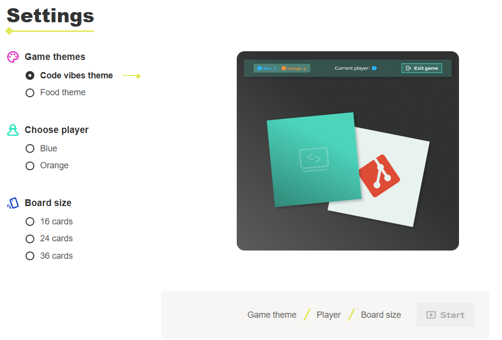
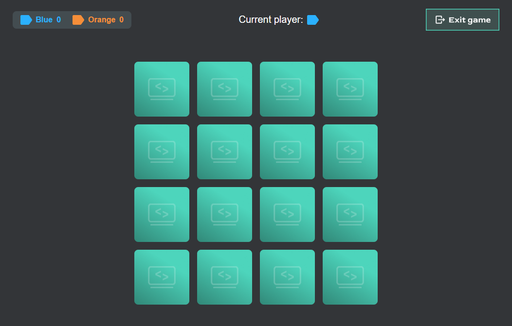

<h1 align="center">Memory Game</h1>

<p align="center"> 
   
</p> 
<p align="center"> 
   
</p> 

<p align="center"> 
  <strong>A modern, interactive browser Memory game built with TypeScript, SCSS, and Vite</strong> 
</p> 

<p align="center"> 
  <a href="https://leonweigang.developerakademie.net/memory/index.html">Play Live</a> 
</p> 

<br> <br>

<strong> Game Overview : </strong>
<br> 
This project is a feature-rich, 2-player browser-based Memory game offering custom game themes, configurable board sizes, and a smooth user experience.
Built with a focus on clean architecture and modern web standards: <br> 

- Strictly-typed modular TypeScript logic
- Scoped SCSS design system with dynamic theme switching
- Fast bundling and multi-page setup using Vite

No heavy UI frameworks. Pure, performant TypeScript & SCSS. <br> <br>

<strong> Features <br> <br> </strong>
<strong> Gameplay : </strong>
- Interactive card-flipping mechanics with match validation
- Dynamic card border highlighting for matched pairs (Theme-dependent green/orange glow)
- Turn-based local 2-player multiplayer mode (Blue vs. Orange)
- Customizable board sizes (16, 24, or 36 cards)

<strong> Game Themes & Customization : </strong>
- **Code Vibes Theme**: Dark terminal-inspired UI with neon green accents
- **Foods Theme**: Light, warm orange UI design
- Pre-game settings menu with interactive preview and live selection state

<strong> User Interface & Overlay : </strong>
- Two-phase dynamic endscreen overlay:
  - **Phase 1**: "Game Over" title and final score reveal
  - **Phase 2**: Automatic transition to Winner / Draw announcement with theme confetti
- Responsive layout optimized for desktop and mobile devices

<strong> Tech & Tooling : </strong>
- LocalStorage integration for persistent game settings
- Asynchronous timed transition sequences
- Vite Multi-Page Application (MPA) configuration

<br>

<strong> Live Demo <br> </strong>
[Play the Game Live](https://leonweigang.developerakademie.net/memory/index.html)

<br>

<strong> How to Play : <br> <br> </strong>
1. Select your desired theme, starting player color, and board size in the settings.
2. Click **Start Game**.
3. Click on cards to flip them and search for matching pairs.
4. Matched cards will stay face-up with a highlighted border glow.
5. The player with the highest score when all pairs are found wins!

<br>

<strong> Architecture <br> </strong>
The application uses a modular architecture with strict separation between settings, core game logic, and styling: <br> <br>

Memory Game
 ├── Settings System (settings.ts)
 │    ├── Form state handler
 │    └── LocalStorage manager
 ├── Core Game Loop (game.ts)
 │    ├── Board generator & card matcher
 │    ├── Score tracker
 │    └── Two-phase endscreen sequence overlay
 ├── Styles (SCSS)
 │    ├── _settings.scss (Theme selection & forms)
 │    ├── _game.scss (Card layout & matched glows)
 │    └── _endcard.scss (Overlay transitions & phases)
 └── Multi-Page Configuration (vite.config.ts)

<br>

<strong> Key Concepts : </strong>
- **TypeScript**: Clean function decomposition (small, maintainable, single-responsibility functions)
- **State Management**: Separation of DOM interaction and UI overlay transitions
- **SCSS Architecture**: Parent-class theme scoping (`body.theme-code-vibes` vs `body.theme-foods`)

<br>

<strong> Tech Stack : </strong>
- **TypeScript** → Type-safe game logic & state management
- **Vite** → Lightning-fast development & multi-page production build tool
- **SCSS / Sass** → Modular CSS styling with CSS nesting and dynamic variables
- **HTML5** → Semantic structure and overlay layers

<br>

<strong> Getting Started : </strong>

1. **Clone the repository**
   ```bash
   git clone [https://github.com/LeonWeigang-Dev/memory]
   cd memory
   npm install
   npm run dev
   ```